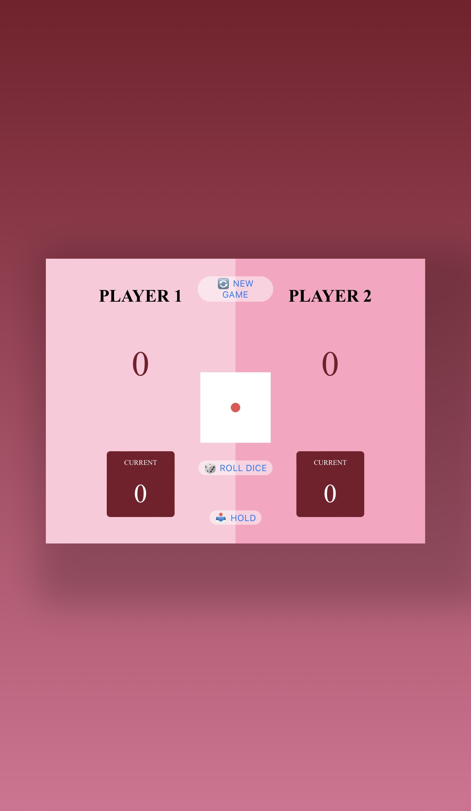

# Pig Dice Game 🎲

A two-player dice game built using **HTML**, **CSS**, and **JavaScript**.

## 🔧 Technologies Used
- HTML5
- CSS3
- JavaScript (ES6+)

## 📱 Features
- Two-player turn-based gameplay
- DOM manipulation for dynamic UI updates
- Roll dice and accumulate points
- Hold score to secure points
- First player to reach 100 wins
- Responsive design

## 📷 Preview
🔗 [Live Site](https://chellyy01.github.io/Pig-Game/)

🖼️

## 📂 How to Use
1. Clone the repository
2. Open `index.html` in your browser
3. Start rolling the dice and have fun!

## 🙋‍♀️ Author
Marypauline Ibute  
GitHub: 🔗 [Chellyy01](https://github.com/Chellyy01)
